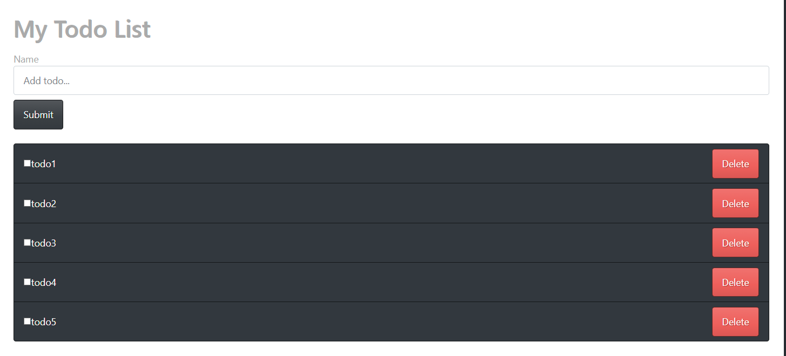
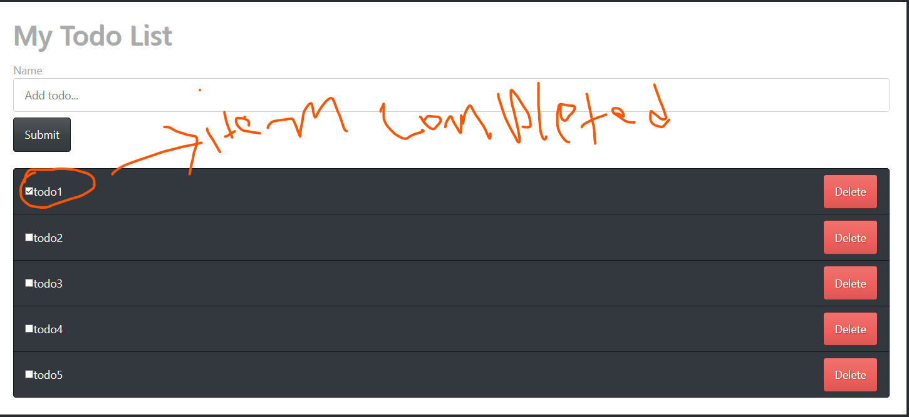
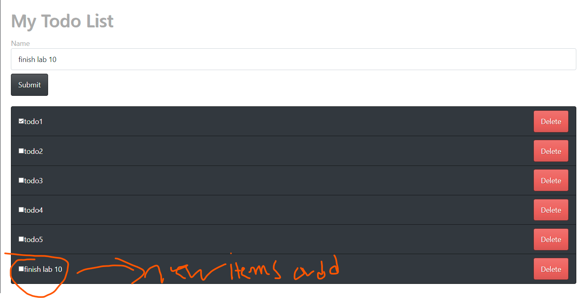

###creating slice on TodoSliceReducer.js 


```
import { createAsyncThunk, createSlice } from '@reduxjs/toolkit';
import { nanoid } from 'nanoid';


export const todoSlice = createSlice({
    name: 'todos',
    initialState: [
        { id: 1, title: 'todo1', completed: false },
        { id: 2, title: 'todo2', completed: false },
        { id: 3, title: 'todo3', completed: true },
        { id: 4, title: 'todo4', completed: false },
        { id: 5, title: 'todo5', completed: false },
    ],
    reducers: {
        addTodo: (state, action) => {
            const todo = {
                id: nanoid(),
                title: action.payload,
                completed: false,
            };
            state.push(todo);
        },
        toggleComplete: (state, action) => {
            const index = state.findIndex((todo) => todo.id === action.payload);
            state[index].completed = action.payload.completed;
        },
        deleteTodo: (state, action) => {
            return state.filter((todo) => todo.id !== action.payload);
        },
    },

});

export const { addTodo, toggleComplete, deleteTodo } = todoSlice.actions;

export default todoSlice.reducer;


```


## exported files for react-redux. 

```
import { createAsyncThunk, createSlice } from '@reduxjs/toolkit';
import { nanoid } from 'nanoid';
```
`import { createAsyncThunk, createSlice } from '@reduxjs/toolkit';`
- createAsyncThunk, createSlice creates the store,action without having to create different files. 

```
export const todoSlice = createSlice({
    name: 'todos',
    initialState: [
        { id: 1, title: 'todo1', completed: false },
        { id: 2, title: 'todo2', completed: false },
        { id: 3, title: 'todo3', completed: true },
        { id: 4, title: 'todo4', completed: false },
        { id: 5, title: 'todo5', completed: false },
    ],
    reducers: {
        addTodo: (state, action) => {
            const todo = {
                id: nanoid(),
                title: action.payload,
                completed: false,
            };
            state.push(todo);
        },
        toggleComplete: (state, action) => {
            const index = state.findIndex((todo) => todo.id === action.payload);
            state[index].completed = action.payload.completed;
        },
        deleteTodo: (state, action) => {
            return state.filter((todo) => todo.id !== action.payload);
        },
    },


```
- `initialState` is for state where all the states will be located 
- `addTodo: (state, action)` this action adds items to list 
- `toggleComplete(state, action)` this updates whether or not status is completed or not 
- `deleteTodo: (state, action)`this deletes the item from the list. 

```
export const { addTodo, toggleComplete, deleteTodo } = todoSlice.actions;
export default todoSlice.reducer;

```
- all thesse are imported so it can be used. 

###Creating the reudcer on configureStore.js
```
import { configureStore } from '@reduxjs/toolkit'
import todoReducer from './TodoSliceReducer';


export const store= configureStore({
    reducer: {
toDo : todoReducer
    },
});

```
- `import { configureStore } from '@reduxjs/toolkit'` this will confgiure store 
- `import todoReducer from './TodoSliceReducer';` this is the to to reducer. 
- `store` will be used to combine stores. 


###Index.js
```
import React from 'react';
import ReactDOM from 'react-dom';
import 'bootswatch/dist/slate/bootstrap.min.css'; // Added this :boom:

import './index.css';
import App from './App';
import reportWebVitals from './reportWebVitals';
import {Provider} from 'react-redux'
import {store} from "./redux/configureStore";

ReactDOM.render(
    <React.StrictMode>
        <Provider store={store}>
            <App/>
        </Provider>
    </React.StrictMode>,
    document.getElementById('root')
);
```

```
  <Provider store={store}>
            <App/>
        </Provider>
```
- using provider gives whole store the access for the application
- all the components will have access to it. 
### index.js file structure  

```
function App() {

  return (
      <div className='container bg-white p-4 mt-5'>
        <h1>My Todo List</h1>
        <AddTodoForm />
        <TodoList />
      </div>
  );
}

export default App;
```
- ` <AddTodoForm />` adds new item to do list 
- ` <TodoList />` this will hold all the information for the list. 

### AddtoForm.js
```
const AddTodoForm = () => {
	const [value, setValue] = useState('');
	const dispatch = useDispatch();
	const onSubmit = (event) => {
		event.preventDefault();
		dispatch(addTodo(value));
	};

	return (
		<form onSubmit={onSubmit} className='form-inline mt-3 mb-3'>
			<label className='sr-only'>Name</label>
			<input
				type='text'
				className='form-control mb-2 mr-sm-2'
				placeholder='Add todo...'
				value={value}
				onChange={(event) => setValue(event.target.value)}
			></input>

			<button type='submit' className='btn btn-primary mb-2'>
				Submit
			</button>
		</form>
	);
};

export default AddTodoForm;


```

- `const dispatch = useDispatch();`
   - this will be used to activate function. 
- ```
  const onSubmit = (event) => {
        event.preventDefault();
        dispatch(addTodo(value));
    }
  
  ```
    - `dispatch(addTodo(value));` this will activate function to event an items. 

### TodoList.js

```
const TodoList = () => {
	const todos = useSelector(state => state.toDo);

	return (
		<ul className='list-group'>
			{todos.map((todo) => (
				<TodoItem id={todo.id} key={todo.id} title={todo.title} completed={todo.completed} />
			))}
		</ul>
	);
};

export default TodoList;

```
`const todos = useSelector(state => state.toDo);`
 - this gives acess to the todoReducer. 


```
{todos.map((todo) => (
				<TodoItem id={todo.id} key={todo.id} title={todo.title} completed={todo.completed} />
			))}

```
- todo holds all the array and is just being passed and will be mapped on TodoItem componenet.
### TodoItem.js
```
const TodoItem = ({ id, title, completed }) => {
	const dispatch = useDispatch();
	return (
		<li className='list-group-item'>
			<div className='d-flex justify-content-between'>
				<span className='d-flex align-items-center'>
					<input type='checkbox' className='mr-3' onClick={()=>dispatch(toggleComplete(id))} ></input>
					{title}
				</span>
				<button className='btn btn-danger' onClick={()=>dispatch(deleteTodo(id))}  >Delete</button>
			</div>
		</li>
	);
};

export default TodoItem;


```
`onClick={()=>dispatch(toggleComplete(id)` 
- this will mark item as complete. 
`<button className='btn btn-danger' onClick={()=>dispatch(deleteTodo(id))}`
- This will delte items from the list. 


# code in actions. 

Homepage

completed

new items added

deleted items


